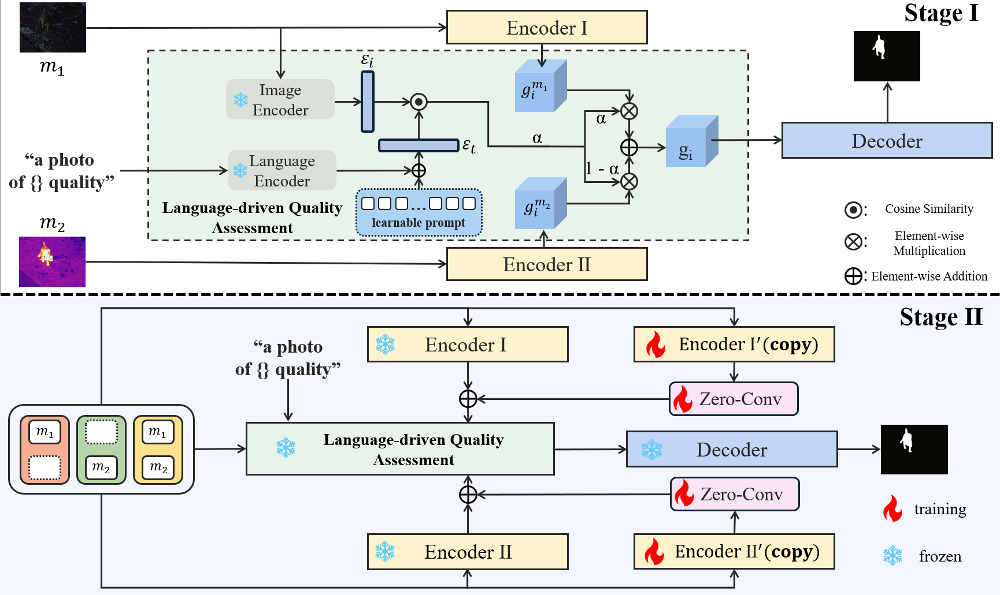

# [ECCV 2024] CoLA: Conditional Dropout and Language-driven Robust Dual-modal Salient Object Detection
[](https://paperswithcode.com/sota/rgb-d-salient-object-detection-on-nju2k?p=cola-conditional-dropout-and-language-driven)
[](https://paperswithcode.com/sota/rgb-d-salient-object-detection-on-nlpr?p=cola-conditional-dropout-and-language-driven)

This repository hosts the code of the research presented in "[CoLA: Conditional Dropout and Language-driven Robust Dual-modal Salient Object Detection](https://www.arxiv.org/abs/2407.06780#)". We provide both **PyTorch** and **MindSpore** versions of the code.


## Environment Requirements
- Python 3.8
- PyTorch 1.13.1
- torch-npu 2.1.0
- torchvision

## Installation
To set up the necessary environment, follow these steps:

```bash
pip install torch==1.13.1 torchvision
```
## Dataset
You can download the RGB-T dataset in :[Baidu Netdisk](https://pan.baidu.com/s/15PaIkKvxld-15tUmlNZqKA?pwd=f2ms)(code: f2ms)

You can download the RGB-D dataset in :[Baidu Netdisk](https://pan.baidu.com/s/1SnBM23Kl9qSbA9ZFqptNPA?pwd=jciu)(code: jciu)

## Training
To train the model, run the following command:

```bash
python train.py
```

Configuration settings can be adjusted in `options.py`. This file contains various parameters and settings that you can modify to customize the training process.

## Testing
For testing the model, use the following command:

```bash
python test.py
```
You can download the RGB-T Checkpoint in [Baidu Netdisk](https://pan.baidu.com/s/1C_dsuWNoq7w4WAFZ1zDgOw?pwd=3954)(code: 3954) or [Google Drive](https://drive.google.com/file/d/1TDv8cr4g6ZtlrDGLm1D1EYy2IViXZIk9/view?usp=sharing).

You can download the RGB-D Checkpoint in [Baidu Netdisk](https://pan.baidu.com/s/1xNujvv0zoHDU6GDoNRvYtQ?pwd=bkr8)(code: bkr8) or [Google Drive](https://drive.google.com/file/d/1TF2QGLr_fT2hvuZcJeRpl8Ofx5yAC9ce/view?usp=sharing).

## Evaluation
We use the following [links](https://github.com/zyjwuyan/SOD_Evaluation_Metrics) for evaluation.


## File Structure
This repository is organized into two primary directories to accommodate both **PyTorch** and **MindSpore** codebases, ensuring compatibility and ease of use across different deep learning frameworks. Each directory mirrors the following structure:
- `options.py`: Configuration file where all the settings for training and testing are modified.
- `ResNet.py`: Contains ResNet-related backbone models and configurations.
- `test.py`: The script used for testing the models.
- `train.py`: The script used for training the models.
- `pytorch_iou`: Contains code for IoU (Intersection over Union) loss computation.
- `data.py`: Includes operations related to data loading and processing.
- `clip`: Files related to the CLIP model.
- `Net.py`: The main network architecture.

## Citation
```BibTeX
@inproceedings{eccv2024cola,
  title={CoLA: Conditional Dropout and Language-driven Robust Dual-modal Salient Object Detection},
  author={Hao, Shuang and Zhong, Chunlin and Tang, He},
  booktitle={European Conference on Computer Vision},
  year={2024}
}
```
